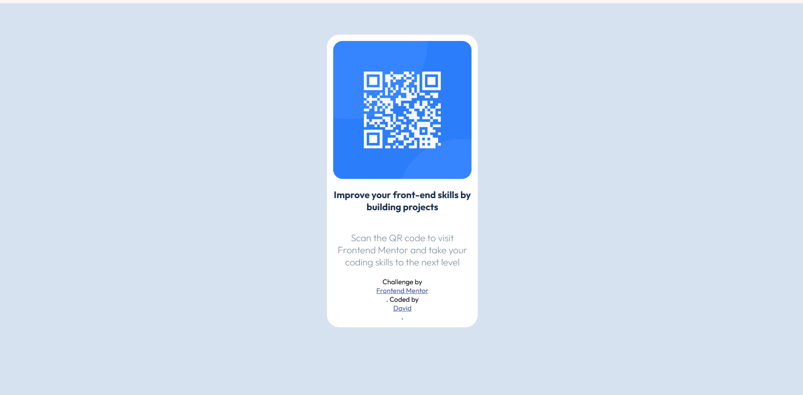

## Table of contents

- [Overview]
  - [Screenshot]
  - [Links]
  - [Built with]
  - [What I learned]
  - [Continued development]
  - [Useful resources]
- [Author](#author)


## Overview

### Screenshot

(qr-code-component-main\)



### Links

- Solution URL: [Add solution URL here](https://your-solution-url.com)
- Live Site URL: [Add live site URL here](https://your-live-site-url.com)


### Built with

- Semantic HTML5 markup
- CSS custom properties
- Flexbox


### What I learned
I have made a significant progress in centering a div

To see how you can add code snippets, see below:

```html
div class="main-container">
  <div class="container">
    <div>
      
        <p id="improve-skills">Improve your front-end skills by building projects</p>
        <p id="scan-qrcode">Scan the QR code to visit Frontend Mentor and take your coding skills to the next level</p>
  </div>
    <div class="attribution">
    Challenge by <a href="https://www.frontendmentor.io?ref=challenge" target="_blank">Frontend Mentor</a>. 
    Coded by <a href="#">David</a>.
    </div>
  </div>
  </div>
```
```css
 .main-container {display: flex; justify-content: center;}
    .container {background-color: white; padding: 10px; width: 220px; border-radius: 20px; position: absolute; top: 50px;}
    .container div {display: flex; flex-direction: column; align-items: center; text-align: center;}
```


### Continued development
Proper positioning
Responsiveness

### Useful resources

- [Example resource 1](www3shcools.com) - This helped me on positioning

## Author

- Website - [DAVID OBENG ADJEI]
- Frontend Mentor - [@davidobeng200](https://www.frontendmentor.io/profile/davidobeng200)

